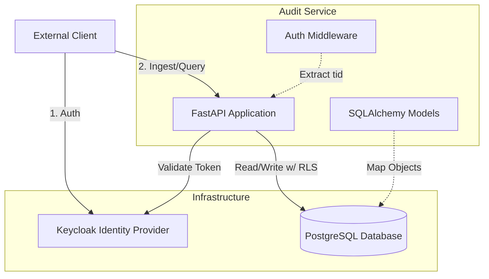
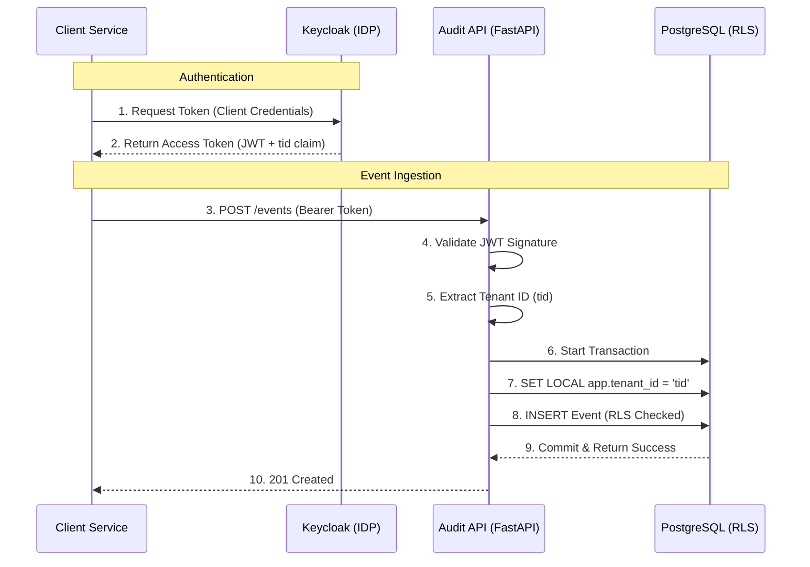

# Audit Service

A high-performance, multi-tenant audit logging system designed for security, immutability, and compliance. Built with **FastAPI**, **PostgreSQL (RLS)**, and **Keycloak**.

## 1. Project Overview

This project provides a centralized service for ingesting, storing, and querying audit logs. It is designed to be:
*   **Multi-tenant:** Strict data isolation using PostgreSQL Row Level Security (RLS).
*   **Immutable:** Events are hashed and append-only.
*   **Entity-Centric:** Logs can be queried not just by time, but by the specific entities involved (e.g., "Show me everything that happened to User:123").
*   **Idempotent:** Built-in mechanisms to handle duplicate event delivery gracefully.

## 2. Key Features

*   **Strict Multi-tenancy:** Uses Postgres RLS to ensure tenants can strictly only access their own data.
*   **Keycloak Integration:** Automated tenant provisioning (creates Keycloak Clients) and OIDC authentication.
*   **Polymorphic Indexing:** Efficient `EventEntity` mapping allows looking up events by any related object (Actor, Resource, Target).
*   **Idempotency:** `idempotency_key` ensures exactly-once processing for event ingestion.
*   **Integrity:** SHA-256 content hashing for event verification.
*   **High Performance:** Async I/O (FastAPI + AsyncPG) and optimized database indexes.

## 3. Architecture & Design

### High-Level Architecture
1.  **Ingestion:** Clients (microservices) authenticate via Keycloak (Client Credentials) and send events to the Audit API.
2.  **Authentication:** The API verifies the JWT. The Tenant ID (`tid` claim) is extracted.
3.  **Data Access:**
    *   The API connects to Postgres as a shared application user (`audit_app`).
    *   Before every query/transaction, the API sets a session variable `app.tenant_id`.
    *   Postgres RLS policies enforce that queries only return rows matching this Tenant ID.
4.  **Storage:**
    *   `events`: Stores the raw JSON payload and metadata.
    *   `event_entities`: A normalized table mapping events to the entities they touch (Actor, Resource, etc.) for fast lookup.

### Components
*   **API Service:** FastAPI application handling HTTP requests.
*   **Identity Provider:** Keycloak managing tenant identities (Clients) and issuing tokens.
*   **Database:** PostgreSQL 15+ storing data with RLS enabled.



## 4. Repository Structure

```
├── app/
│   ├── api/            # Route handlers (Ingestion, Timeline, Admin)
│   ├── core/           # Auth logic, Keycloak integration
│   ├── models.py       # SQLAlchemy database models (Event, Tenant)
│   ├── config.py       # Application configuration
│   └── database.py     # DB connection setup
├── alembic/            # Database migration scripts
├── scripts/            # Helper scripts (Bootstrap, Dev Up/Down)
├── tests/              # Pytest suites
├── load_tests/         # Locust load testing scripts
└── docker-compose.yml  # Local infrastructure (Postgres, Keycloak)
```

## 5. Getting Started

### Prerequisites
*   **Docker & Docker Compose**
*   **Python 3.10+**
*   `psql` (optional, for debugging DB)

### Installation

1.  **Clone the repository:**
    ```bash
    git clone <repo_url>
    cd audit
    ```

2.  **Set up Python environment:**
    ```bash
    python -m venv venv
    source venv/bin/activate
    pip install -r requirements.txt
    ```

3.  **Bootstrap the local environment:**
    This script starts Docker containers, runs migrations, and configures Keycloak.
    ```bash
    ./scripts/bootstrap.sh
    ```

4.  **Start the API server:**
    ```bash
    ./scripts/server.sh
    ```
    The API will be available at `http://localhost:8000`.

### Configuration
Configuration is managed via environment variables. Copy `env.example` to `.env` and adjust as needed.

```bash
cp env.example .env
```

| Variable | Description |
|----------|-------------|
| `DATABASE_URL` | App connection string (RLS user) |
| `ADMIN_DATABASE_URL` | Admin connection string (Owner) |
| `KEYCLOAK_URL` | Keycloak internal URL |
| `ADMIN_API_KEY` | Key for internal admin routes |

## 6. How It Works



### Event Ingestion Flow
1.  Client requests a token from Keycloak (`client_credentials` grant).
2.  Client POSTs event to `/v1/events` with Bearer token.
3.  **Middleware:** Validates JWT and extracts `tid` (Tenant ID).
4.  **DB Session:** Sets `SET LOCAL app.tenant_id = '...'`.
5.  **Logic:**
    *   Calculates SHA-256 hash of payload + metadata.
    *   Checks `idempotency_key`.
    *   Inserts `Event` and related `EventEntity` rows.
    *   Commits transaction.

### Row Level Security (RLS)
Security is enforced at the database layer. Even if the API code has a bug in a `WHERE` clause, Postgres prevents cross-tenant data leakage.
*   **Policy:** `CREATE POLICY tenant_isolation ON events USING (tenant_id = current_setting('app.tenant_id')::text);`

## 7. Usage Examples

### 1. Create a Tenant (Admin)
First, you need a tenant to interact with the system.
```bash
curl -X POST "http://localhost:8000/admin/tenants" \
  -H "X-Admin-Key: dev-admin-key" \
  -H "Content-Type: application/json" \
  -d '{"name": "Acme Corp"}'
```
*Response:* Returns a `client_id` and `client_secret` to be used by this tenant.

### 2. Get an Access Token
Use the credentials from the previous step.
```bash
export CLIENT_ID="tenant-..."
export CLIENT_SECRET="..."

TOKEN=$(curl -s -d "client_id=$CLIENT_ID" \
  -d "client_secret=$CLIENT_SECRET" \
  -d "grant_type=client_credentials" \
  "http://localhost:8080/realms/audit-realm/protocol/openid-connect/token" \
  | jq -r .access_token)
```

### 3. Send an Audit Event
```bash
curl -X POST "http://localhost:8000/v1/events" \
  -H "Authorization: Bearer $TOKEN" \
  -H "Content-Type: application/json" \
  -d '{
    "occurred_at": "2023-10-27T10:00:00Z",
    "type": "user.login",
    "actor": {"kind": "user", "id": "u-123"},
    "idempotency_key": "uuid-req-1",
    "payload": {"ip": "1.2.3.4", "status": "success"},
    "entities": [
      {"kind": "user", "id": "u-123"}
    ]
  }'
```

### 4. Query Timeline
```bash
curl "http://localhost:8000/v1/timeline?entity=user:u-123" \
  -H "Authorization: Bearer $TOKEN"
```

## 8. Development Guide

### Running Tests
Unit and integration tests are located in `tests/`.
```bash
pytest
```

### Database Migrations
Changes to `app/models.py` require a new Alembic migration.
```bash
# Create migration
alembic revision --autogenerate -m "describe_change"

# Apply migration
alembic upgrade head
```

### Load Testing
Locust is used for load testing.
```bash
# Start Locust
locust -f load_tests/locustfile.py
```

## 9. Operational Notes

*   **Database User:** The application runs as `audit_app`, which has permissions to INSERT/SELECT but cannot bypass RLS policies.
*   **Indexing:** `events` and `event_entities` are heavily indexed by `tenant_id` and timestamp.
*   **Security:** Ensure `ADMIN_API_KEY` is rotated and secured in production. Keycloak should run behind TLS.

## 10. Future Improvements
*   **Event Archival:** Move old events to cold storage (S3/Parquet).
*   **Webhooks:** Trigger external webhooks on specific event types.
*   **UI Console:** A frontend for admins to browse logs.
*   **Signature Verification:** Sign event hashes with a private key for non-repudiation.

